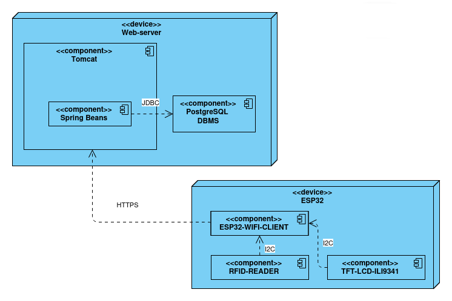
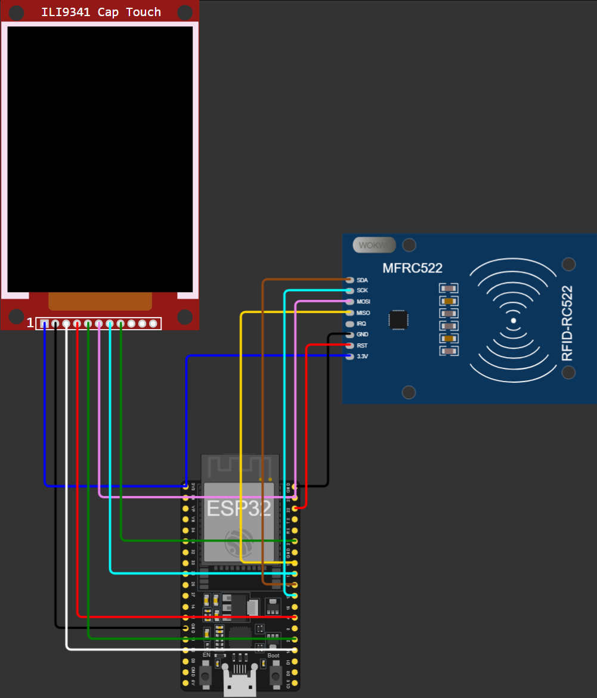

# RFID-card-manager

Программно-аппаратный комплекс для регистрации, привязки, блокировки и мониторинга статуса RFID-карт с базой пользователей и журналом событий доступа.

> [!NOTE]
> Проект выполнен в рамках курса «Встроенные системы». Основа: ESP32 + PN532, управление через сенсорный экран на устройстве и Web-панель.

## Возможности

- Чтение UID карты при поднесении к считывателю
- Регистрация карт с правами доступа и привязкой к профилю пользователя
- Блокировка и удаление утерянных карт
- Журнал событий: время, права, статус входа, UID
- Управление локально (GUI на экране) и удалённо (Web-панель)

> [!NOTE]
> При потере связи с сервером устройство продолжает работать по локальному кэшу карт.

## Железо

| Компонент | Кол-во | Цена, ₽ |
|---|---|---|
| RFID-модуль PN532 с NFC | 1 | 345 |
| TFT LCD-дисплей | 1 | 803 |
| ESP-WROOM-32 | 1 | 499 |
| Карты MIFARE DESFire EV3 | 3 | 315 |

Также нужны светодиод и зуммер для индикации. Питание 5V/12V через USB или внешний блок.


## Архитектура

```
[Карта] -> [PN532] -> [ESP32 + GUI] --Wi-Fi / HTTPS--> [Web-сервер + БД] <-- [Web-панель]
                           |
                     локальный кэш
```

Питание:

```
[USB / блок питания 5V/12V] -> [ESP32] -> 3.3V -> [PN532]
                                                  [TFT-дисплей]
```

> [!NOTE]
> Устройство питается от стандартного источника постоянного тока 5V/12V через USB или внешний блок. Периферия работает от 3.3V с платы ESP32.





[](https://wokwi.com/projects/477347887993527297)

## Безопасность

- TLS / HTTPS между станцией и сервером
- SHA-2 для хеширования ключей, AES для шифрования
- Challenge-response для взаимной аутентификации считывателя и метки
- HMAC (SHA-2) для проверки целостности сообщений

> [!NOTE]
> Время от считывания карты до ответа сервера не должно превышать 3 секунд.

## Условия эксплуатации

- Температура: 0...+35 °C
- Влажность: до 80 % без конденсации
- ПО модуля управления: Linux, Windows, macOS
- Интеграция: HTTPS / REST / JSON

## Структура репозитория

```
RFID-card-manager/
├── firmware/    # прошивка ESP32
├── server/      # Web-сервер, бизнес-логика, БД
├── docs/        # ТЗ, схемы подключения, руководство
└── README.md
```

> [!NOTE]
> Структура примерная, подправьте под реальные папки.

## Быстрый старт

1. Клонировать репозиторий:
   ```bash
   git clone https://github.com/YushisNoN/RFID-card-manager.git
   ```
2. Собрать схему по документации из `docs/`
3. Прошить ESP32, указать Wi-Fi и адрес сервера
4. Запустить сервер и открыть Web-панель

## Испытания

- Функциональные: распознавание зарегистрированных карт, блокировка неизвестных
- Стресс: частое поднесение карт, стабильность соединения

## Команда

| Участник | Зона ответственности |
|---|---|
| Чайковский Никита | бизнес-логика, шифрование, считывание карт |
| Никитенко Матвей | макет в Wokwi, проектирование БД, Web-сервер, GUI |
| Деревянко Владимир | Web-сервер, обмен с сервером, GUI |

## Источники

- ГОСТ 19.201-78. Техническое задание. Требования к содержанию и оформлению
